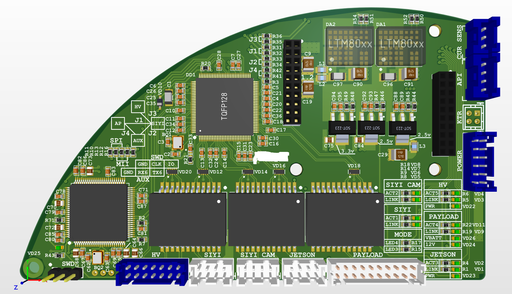
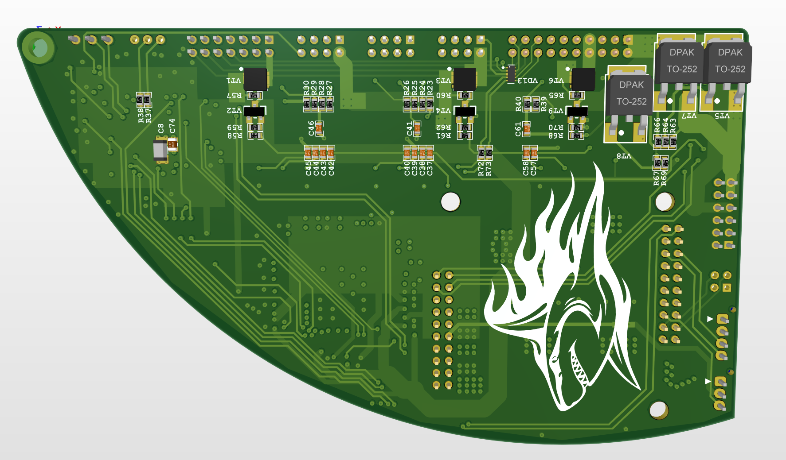

# 📑 Multi-Processor Industrial Carrier Board (Avionics & Network Gateway)

This repository presents the hardware architecture and PCB design overview for a high-density, multi-processor carrier board designed for industrial robotic systems and mission control. 

The board serves as a central computing hub, bridging deterministic real-time control loops with high-level edge AI processing, multi-channel gigabit network routing, and payload management.

---

## 🛠 TECHNICAL SPECIFICATIONS & ARCHITECTURE

*   **Form Factor:** Custom curved wing geometry optimized for tight mechanical enclosure constraints.
*   **Core Logic:** TQFP128 MCU node handling real-time peripheral control and deterministic task scheduling.
*   **Network & Routing:** Integrated multi-port Gigabit Ethernet architecture managing synchronous internal traffic between high-performance processing nodes, an **NVIDIA Jetson Nano** compute module, and digital FPV/Payload vision streams.
*   **Power Delivery Network (PDN):** High-reliability power rails driven by dual **Linear Technology LTM80xx** step-down regulator modules, providing ultra-clean, isolated voltages for sensitive analog circuitry and high-speed digital subsystems.
*   **Interfaces:** Multi-channel high-speed interfaces including Ethernet (PHY/MII routing), CAN bus, UART/USART APIs, high-density parallel memory expansion, and multi-channel telemetry diagnostic ports.

---

## 📸 HARDWARE VISUALIZATION

### Component Side (Top View)
The layout features tight component packing, optimized decoupling capacitor arrays directly under power pins, high-precision differential pair routing, and stable power planes.

### Solder Side (Bottom View)
Demonstrates precise impedance-controlled high-speed routing, clean ground pour distributions, and power MOSFET switching stages under solid thermal management constraints.

*Note: Critical branding, sensitive proprietary markings, and specific internal net naming have been sanitized or masked to comply with non-disclosure agreements (NDA).*

---

## 🔬 HARDWARE DESIGN HIGHLIGHTS

1. **Signal Integrity (SI):** High-frequency digital busses and differential pair lines were routed with strict impedance control to ensure zero packet loss across the internal network switch and Edge AI links.
2. **Thermal & Power Integrity (PI):** Heavy thermal reliefs and dense copper pours were calculated for power lines, ensuring the LTM80xx modules operate safely under peak power spikes from heavy peripheral actuators.
3. **Autonomy:** Developed entirely in an advanced EDA environment (Altium Designer), including full 3D mechanical clearance checking and enclosure integration.
